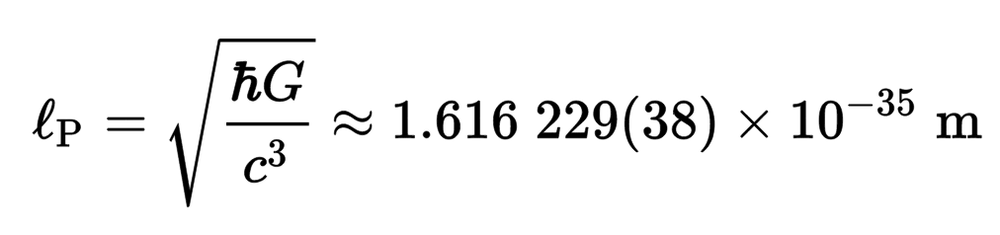
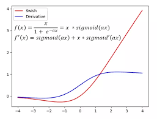

# planckgrad
An autograd engine inspired by Andrej Karpathy's
[micrograd](https://github.com/karpathy/micrograd).



Named after the Planck length, although, amusingly, this library is larger than micrograd due to several enhancements:

- Avoids declaring lambda functions per `Value` instance, reducing memory usage and resulting in a cleaner object model.
- Implements iterative topological sorting, as Python's recursion can be slower compared to an explicit stack.
- Optimizes subtraction to avoid creating temporary objects, improving computational efficiency.
- Embeds a convenient `MLP.train()` method directly within the `MLP` class.
- Validates the input shape of the `MLP`, preventing silent mismatches between expected and actual input dimensions.

## How It Works

At its core, planckgrad is a scalar-based autograd engine. The Value class tracks computations, builds a computational graph, and supports automatic differentiation through backpropagation. It includes:

- Basic arithmetic (`+`, `-`, `*`, `/`, `**`)
- Activation functions: **sigmoid** and **SiLU (Swish)**
- An efficient backpropagation system using topological sorting

## Neural Network Support

The library includes a simple multi-layer perceptron (MLP) built from:

- `Neuron` – a basic perceptron with weights, bias, and an activation function.
- `Layer` – a collection of neurons.
- `MLP` – a full feedforward network with multiple layers.
    
## Activation function: **SiLU (Swish)**:

Introduced in the paper [Gaussian Error Linear Units (GELUs)](https://arxiv.org/pdf/1606.08415), SiLU is a smooth approximation using the sigmoid function.

SiLU maintains a non-zero gradient even for large input values, unlike the sigmoid function, which saturates at extremes (outputs close to 0 and 1).




## Quickstart

To create and train an MLP:
```
from planckgrad import MLP

# Define a network with input size 3, two hidden layers (3 and 5 neurons), and an output layer with 1 neuron.
model = MLP([3, 3, 5, 1])

# Example training data
xs = [
    [2.0, 3.0, -1.0],
    [3.0, -1.0, 0.5],
    [0.5, 1.0, 1.0],
    [1.0, 1.0, -1.0],
]
ys = [1.0, -1.0, -1.0, 1.0]  # Expected outputs

# Train for 1000 epochs with a step size of 0.001
model.train(xs, ys, epochs=1000, step_size=0.001)
```

For a full example, see [train_test_demo.ipynb](train_test_demo.ipynb).


